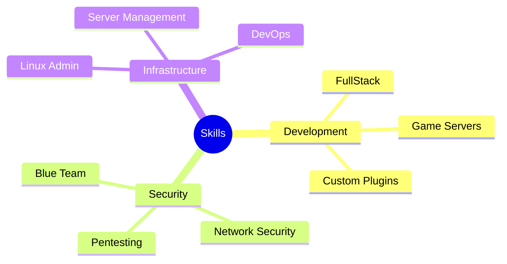

<div align="center">

# Pedro Riccio

[](https://www.linkedin.com/in/pedro-riccio/)
[](https://pedro-dev-cyan.vercel.app/)
[](https://discord.com/invite/GQV5bGhnqF)
[](https://www.instagram.com/pedro_ll7ll/)
[](mailto:pedroworkdev@gmail.com)

</div>

## 🎯 About Me

```python
class SoftwareEngineer:
    def __init__(self):
        self.name = "Pedro Riccio"
        self.role = "Backend Software Engineer"
        self.location = "Brazil"
        self.email = "pedroworkdev@gmail.com"
        self.languages = ["Portuguese (Native)", "English (Intermediate)", "Spanish (Intermediate)"]
        self.specialities = ["Backend Development", "Cybersecurity", "Technical Management"]
        self.focus = ["Server Architecture", "Distributed Systems", "Digital Security"]
```

**Software Engineer** specialized in **BACKEND** development, with solid experience in **cybersecurity** and **technical management**. Professional who masters server architectures and distributed systems, complemented by frontend skills for creating complete technological solutions.

Specialist in high-impact digital security projects, combining technical efficiency with administrative competencies for strategic results. I work as a **Freelance Backend Developer**, providing website development and maintenance services, database management, and system implementation.

### 🚀 Professional Experience

- **Backend Developer (Freelancer)**
- **Technical Support** (Remote/On-site)
- **Website Development and Maintenance**
- **Database Management**
- **Computer maintenance and technical support**
- **Linux Server Management**
- **Game mods and plugins development**
- **Custom hardware and software solutions**

## 💼 Professional Skills



## 🛠️ Technical Skills

### 💻 Programming Languages


### 🗄️ Database Management


### 🏗️ Frameworks & DevOps Tools


### 🎨 Web Development


### 💻 Operating Systems


### 📊 Microsoft Office Suite


**Advanced proficiency in:**
- Microsoft Excel (complex formulas, pivot tables, macros)
- Microsoft Word (advanced formatting, mail merge, technical documentation)
- Microsoft PowerPoint (professional presentations, multimedia resources)
- Microsoft Outlook (email management, calendars, and tasks)

### 🏛️ Development Principles & Methodologies
- **MVC** (Model-View-Controller)
- **DDD** (Domain-Driven Design)
- **SOLID** Principles
- **Clean Code**
- **KISS** (Keep It Simple, Stupid)

## 🎓 Academic Background

**Technology Degree in Systems Analysis and Development**  
*Uniamérica* | 2022 - 2025 | **Completed**

**Postgraduate in Software Engineering**  
*Uniamérica* | 2025 - **In Progress**

## 🏆 Certifications

### Google
- Computer Network Structure and Operations
- Technical Support Fundamentals

### Alura
- Python
- Networks
- MySQL
- Linux
- Java
- Frontend
- Backend

### Uniamérica
- Cybersecurity
- BI and Big Data
- Mobile Developer
- Intelligent Data Structures

## 🌍 Languages


## 🌟 Interests & Hobbies

- ♟️ **Chess**: Strategic thinking and problem-solving enthusiast
- 🏃 **Athletics**: Dedicated runner and sports competitor
- 🏋️‍♂️ **Fitness**: Committed to maintaining a healthy work-life balance
- 📚 **Reading**: Continuous learner and knowledge seeker

## 📊 GitHub Stats

<div align="center">
  
</div>

<div align="center">
  
</div>

---

<div align="center">

### 💡 "Code is poetry, security is art, and innovation is the future."

*Open for collaborations and new opportunities!*

</div>

