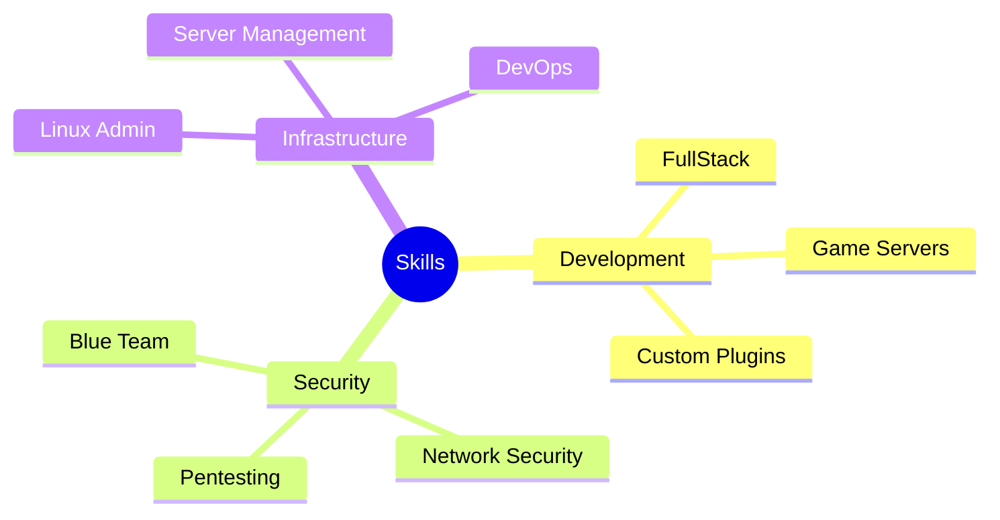

<div align="center">

# Pedro Riccio

[](https://www.linkedin.com/in/pedro-riccio/)
[](https://pedro-dev-cyan.vercel.app/)
[](https://discordia-server.ddns.net/)
[](https://discord.com/invite/GQV5bGhnqF)
[](https://www.instagram.com/pedro_ll7ll/)

</div>

## 🎯 About Me

```python
class SoftwareEngineer:
    def __init__(self):
        self.name = "Pedro"
        self.role = "Software Engineer"
        self.location = "Brazil"
        self.languages = ["Portuguese", "English", "Spanish"]
        self.specialities = ["FullStack Development", "Cybersecurity"]
```

Passionate Software Engineer with expertise in **BackEnd Development** and **Cybersecurity**. I specialize in Blue Team operations and have extensive experience in web development, security implementation, and game server development. Always seeking new challenges and opportunities to innovate in the tech world! 🚀

## 💼 Professional Skills



## 🛠️ Tech Stack

### 🔙 Back-End Development


### 🎨 Front-End Development


### 🗄️ Databases & DevOps


### 💻 Operating Systems


## 🌟 Interests & Hobbies

- ♟️ **Chess**: Strategic thinking and problem-solving enthusiast
- 🏃 **Athletics**: Dedicated runner and sports competitor
- 🏋️‍♂️ **Fitness**: Committed to maintaining a healthy work-life balance
- 📚 **Reading**: Continuous learner and knowledge seeker

## 📊 GitHub Stats

<div align="center">
  
</div>

<div align="center">
  
</div>

---

<div align="center">

### 💡 "Code is poetry, security is art, and innovation is the future."

*Open for collaborations and new opportunities!*

</div>
