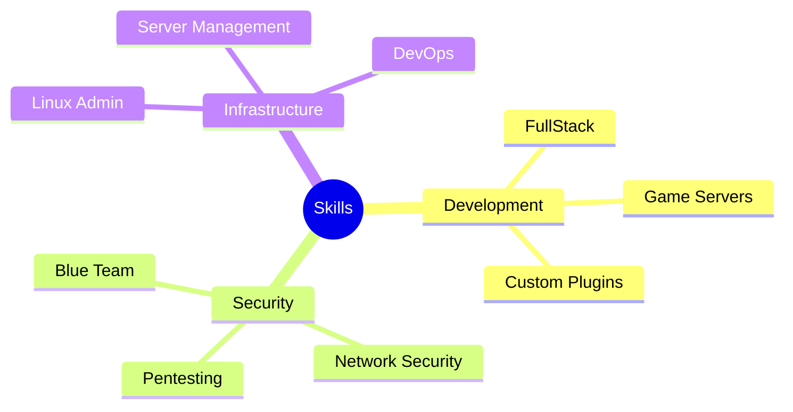

<div align="center">

# 👋 Hello, I'm Pedro Riccio


<br/>

### 🚀 Passionate about creating robust backend solutions and secure digital environments

<br/>

[](https://www.linkedin.com/in/pedro-riccio/)
[](https://pedro-dev-cyan.vercel.app/)
[](https://discord.com/invite/GQV5bGhnqF)
[](https://www.instagram.com/pedro_ll7ll/)
[](mailto:pedroworkdev@gmail.com)


</div>

<br/>

<div align="center">

## 🎯 About Me


</div>

<table align="center">
<tr>
<td width="50%">

```python
class SoftwareEngineer:
    def __init__(self):
        self.name = "Pedro Riccio"
        self.role = "Backend Software Engineer"
        self.location = "Brazil 🇧🇷"
        self.email = "pedroworkdev@gmail.com"
        self.languages = [
            "Portuguese (Native)", 
            "English (Intermediate)", 
            "Spanish (Intermediate)"
        ]
        self.specialities = [
            "Backend Development",
            "Cybersecurity", 
            "Technical Management"
        ]
        self.focus = [
            "Server Architecture",
            "Distributed Systems", 
            "Digital Security"
        ]
        
    def get_current_status(self):
        return "Building secure and scalable solutions 🚀"
```

</td>
<td width="50%">

<div align="center">

</div>

</td>
</tr>
</table>

<div align="center">

### 💡 Professional Summary

</div>

**Software Engineer** specialized in **BACKEND** development, with solid experience in **cybersecurity** and **technical management**. Professional who masters server architectures and distributed systems, complemented by frontend skills for creating complete technological solutions.

Specialist in high-impact digital security projects, combining technical efficiency with administrative competencies for strategic results. I work as a **Freelance Backend Developer**, providing website development and maintenance services, database management, and system implementation.

<div align="center">

### 🚀 Professional Experience


</div>

<table align="center">
<tr>
<td width="50%">

🔧 **Technical Services**
- Backend Developer (Freelancer)
- Technical Support (Remote/On-site)
- Website Development and Maintenance
- Database Management

</td>
<td width="50%">

⚙️ **Specialized Solutions**
- Computer maintenance and technical support
- Linux Server Management
- Game mods and plugins development
- Custom hardware and software solutions

</td>
</tr>
</table>

## 💼 Professional Skills



<div align="center">

## 🛠️ Technical Skills


</div>

<table align="center">
<tr>
<td width="50%" valign="top">

### 💻 Programming Languages
<div align="center">


</div>

### 🗄️ Database Management
<div align="center">


</div>

### 🏗️ Frameworks & DevOps
<div align="center">


</div>

</td>
<td width="50%" valign="top">

### 🎨 Web Development
<div align="center">


</div>

### 💻 Operating Systems
<div align="center">


</div>

### 🔧 Version Control
<div align="center">


</div>

</td>
</tr>
</table>

<div align="center">

### 📊 Microsoft Office Suite


</div>

<details>
<summary><b>📋 Advanced Office Proficiency</b></summary>
<br>

- **Microsoft Excel**: Complex formulas, pivot tables, macros, data analysis
- **Microsoft Word**: Advanced formatting, mail merge, technical documentation
- **Microsoft PowerPoint**: Professional presentations, multimedia resources, design
- **Microsoft Outlook**: Email management, calendars, task organization

</details>

<div align="center">

### 🏛️ Development Principles & Methodologies


</div>

<table align="center">
<tr>
<td align="center" width="20%">
<br/>
<b>MVC</b><br/>
<sub>Model-View-Controller</sub>
</td>
<td align="center" width="20%">
<br/>
<b>DDD</b><br/>
<sub>Domain-Driven Design</sub>
</td>
<td align="center" width="20%">
<br/>
<b>SOLID</b><br/>
<sub>Design Principles</sub>
</td>
<td align="center" width="20%">
<br/>
<b>Clean Code</b><br/>
<sub>Best Practices</sub>
</td>
<td align="center" width="20%">
<br/>
<b>KISS</b><br/>
<sub>Keep It Simple</sub>
</td>
</tr>
</table>

<div align="center">

## 🎓 Academic Background


</div>

<table align="center">
<tr>
<td align="center" width="50%">
<br/>
<h3>🎯 Technology Degree</h3>
<b>Systems Analysis and Development</b><br/>
<i>Uniamérica</i> | 2022 - 2025<br/>

</td>
<td align="center" width="50%">
<br/>
<h3>🚀 Postgraduate</h3>
<b>Software Engineering</b><br/>
<i>Uniamérica</i> | 2025<br/>

</td>
</tr>
</table>

<div align="center">

## 🏆 Certifications


</div>

<table align="center">
<tr>
<td width="33%" align="center">

###  Google
<br/>


</td>
<td width="33%" align="center">

###  Alura
<br/>


</td>
<td width="33%" align="center">

###  Uniamérica
<br/>


</td>
</tr>
</table>

<div align="center">

## 🌍 Languages


</div>

<table align="center">
<tr>
<td align="center" width="33%">
<br/>
<b>Portuguese</b><br/>

</td>
<td align="center" width="33%">
<br/>
<b>English</b><br/>

</td>
<td align="center" width="33%">
<br/>
<b>Spanish</b><br/>

</td>
</tr>
</table>

<div align="center">

## 🌟 Interests & Hobbies


</div>

<table align="center">
<tr>
<td align="center" width="25%">
<br/>
<b>♟️ Chess</b><br/>
<sub>Strategic thinking and problem-solving</sub>
</td>
<td align="center" width="25%">
<br/>
<b>🏃 Athletics</b><br/>
<sub>Dedicated runner and sports competitor</sub>
</td>
<td align="center" width="25%">
<br/>
<b>🏋️‍♂️ Fitness</b><br/>
<sub>Maintaining healthy work-life balance</sub>
</td>
<td align="center" width="25%">
<br/>
<b>📚 Reading</b><br/>
<sub>Continuous learner and knowledge seeker</sub>
</td>
</tr>
</table>

<div align="center">

## 📊 GitHub Analytics


</div>

<table align="center">
<tr>
<td width="50%">

</td>
<td width="50%">

</td>
</tr>
</table>

<div align="center">

</div>

<div align="center">

## 🎯 Activity Graph


</div>

<div align="center">

## 🏆 GitHub Trophies


</div>

<div align="center">
  
</div>

---

<div align="center">

### 💡 *"Code is poetry, security is art, and innovation is the future."*


<br/>


</div>
